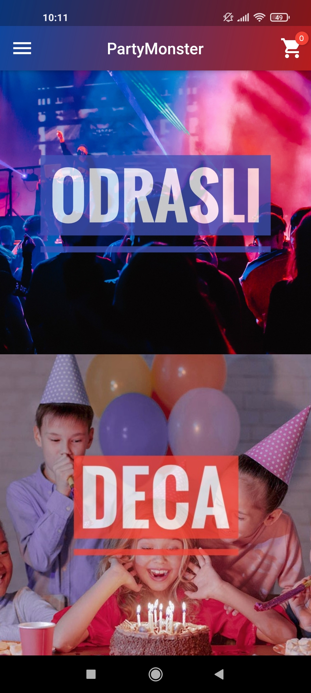
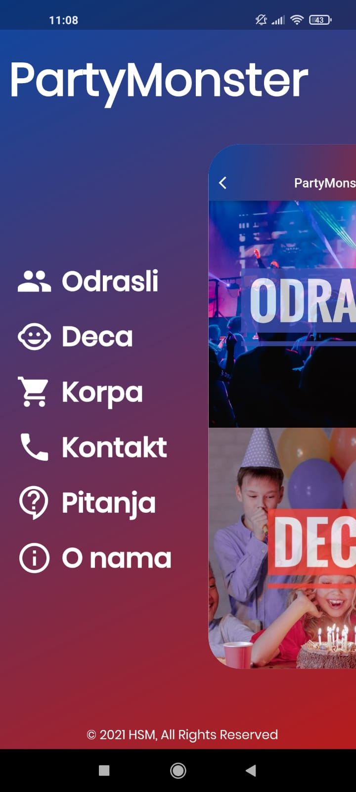
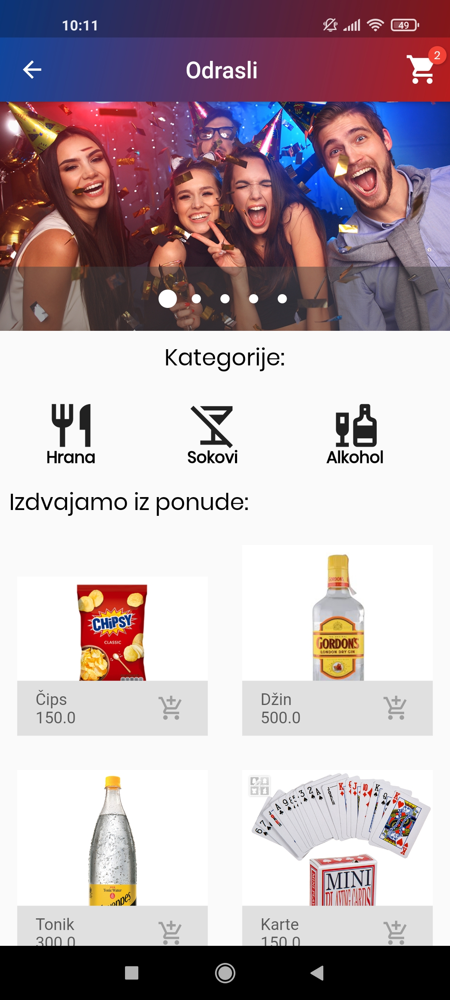
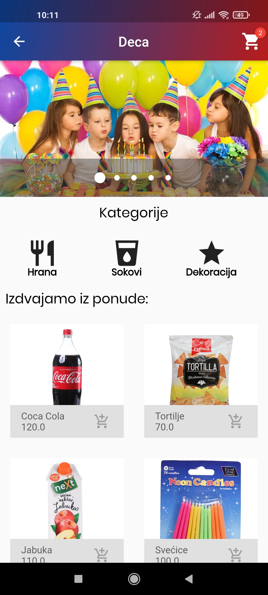
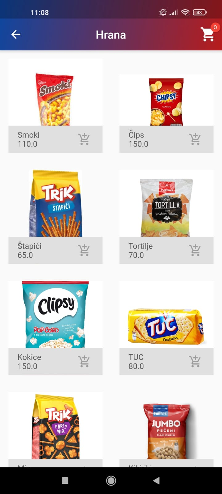
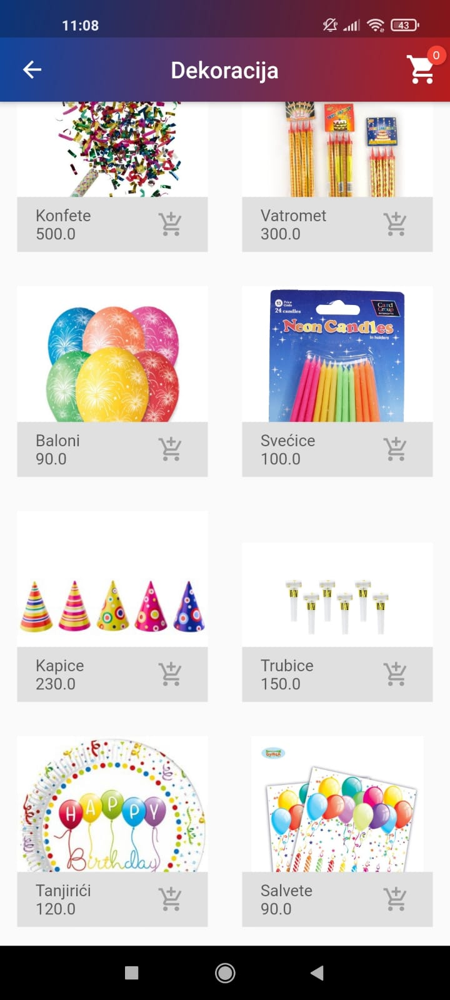
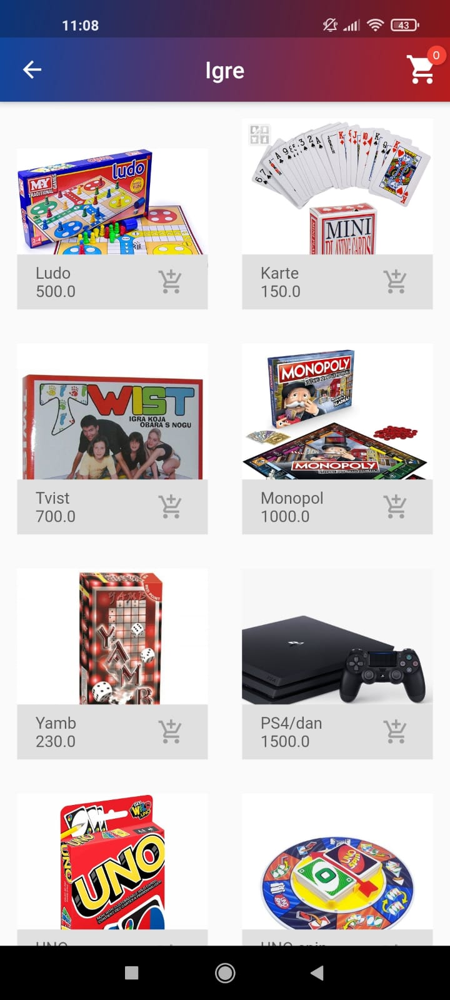
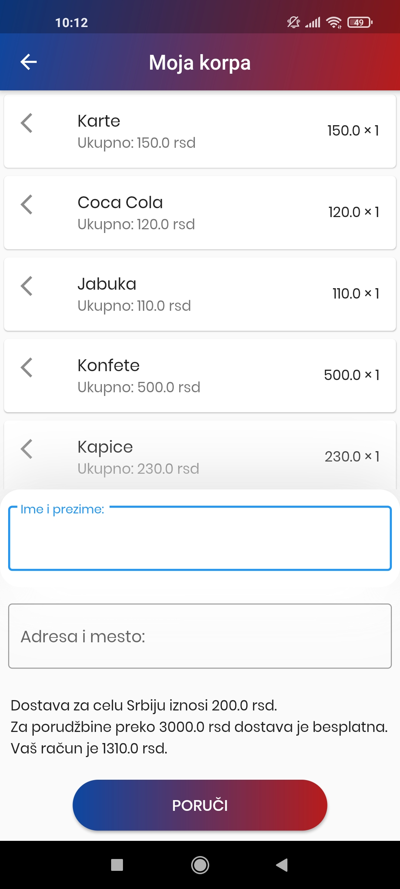
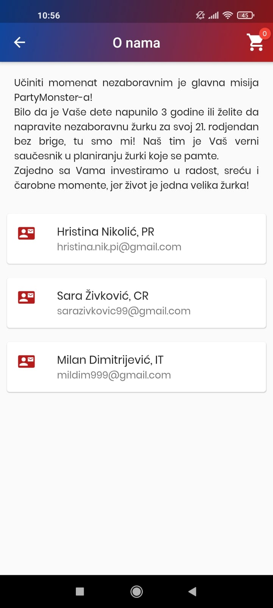
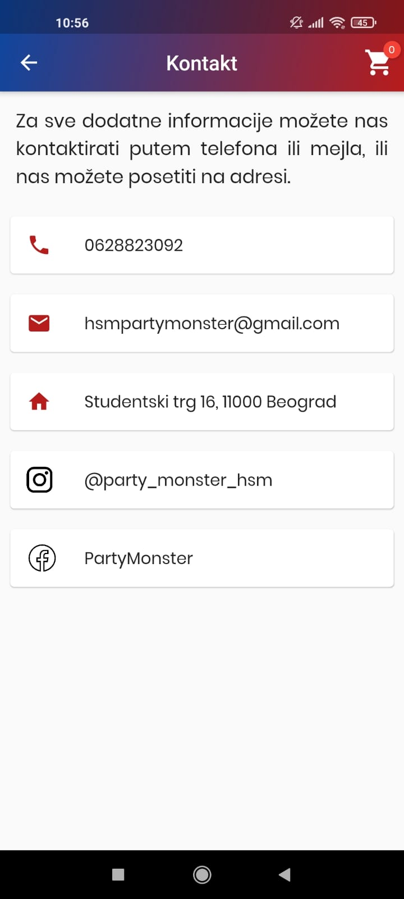

# :tada:Party monster

This project is the idea of 3 students of the Faculty of Mathematics in Belgrade who are eager to facilitate the organization of parties for themselves and others.\
For that reason we made **Party Monster, the prototip of an online-shopping app in Dart**.

*Our app logo*

These are just some of our pages!

| HOME PAGE | MENU | ADULTS PAGE | KIDS PAGE |
|-----------|------------|-----------|------------|
|   |  |  |  |

| FOOD | DECORATION | GAMES | CART PAGE |
|-----------|------------|-----------|------------|
|   |  |  |  |

<h2>:computer:Languages and technologies</h2>
For building our app we used Dart programing language and framework Flutter in Visual Studio Code.

<h2>:wrench:The environment</h2>
The app is made for Android and IOS operating system. 
<h2>:open_file_folder:You will need</h2>

<h2>:checkered_flag:Run the app</h2> 
<h2>:mortar_board:Authors</h2>

Hristina Nikolic mr18103 [hristina.nik.pi@gmail.com](mailto:hristina.nik.pi@gmail.com)

Sara Zivkovic mr18022 [sarazivkovic99@gmail.com](mailto:sarazivkovic@gmail.com)

Milan Dimitrijevic mr18307 [mildim999@gmail.com](mailto:mildim999@gmail.com) 

<h4>:mailbox:Our business mail(Contact us!):</h4>

[hsmpartymonster@gmail.com](mailto:hsmpartymonster@gmail.com) 

You can also see these information on our app.

| ABOUT US | CONTACT US |
|-----------|------------|
|   |  |

